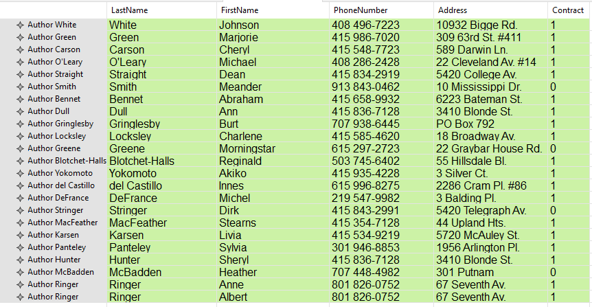
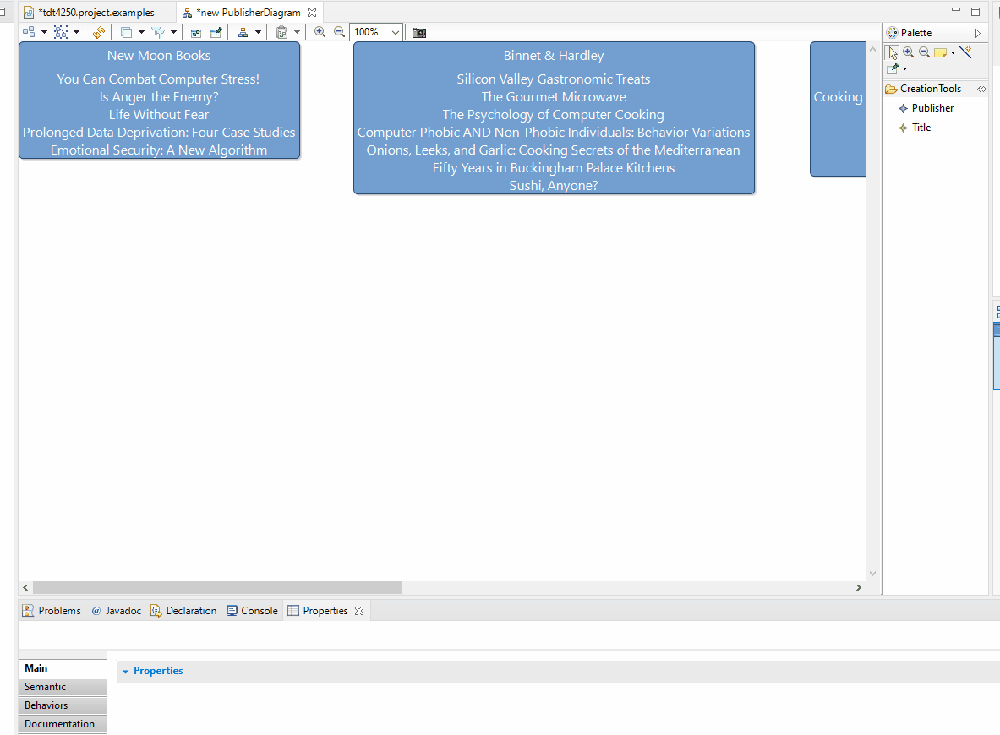
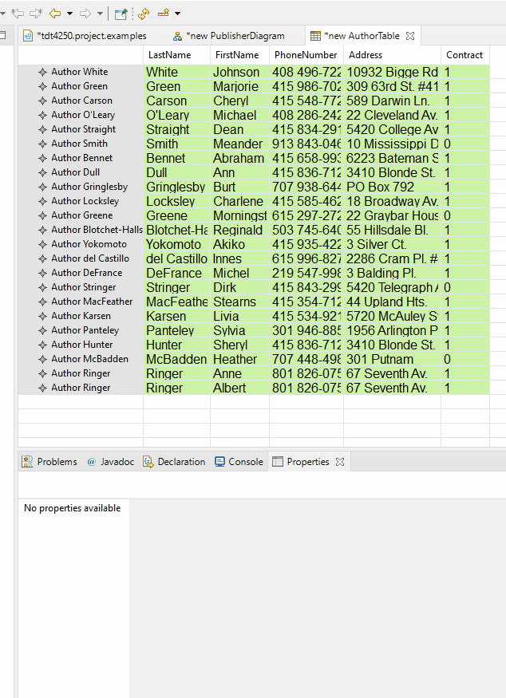
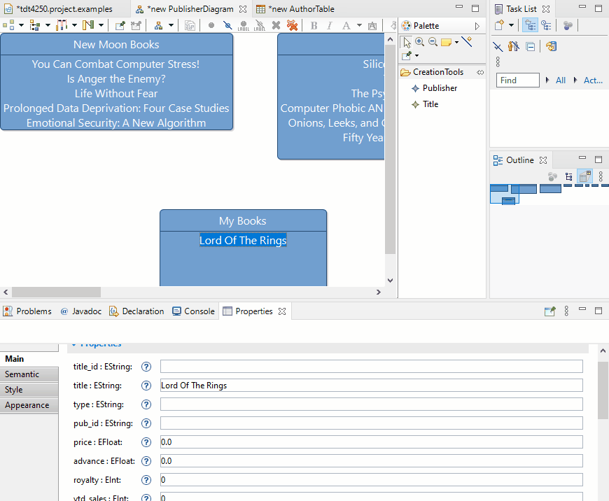

# TDT4250 Project 2020

## Contributors
This project was made by:
* Marcus Hauge
* Eskild Brobak
* Nikolai Mork
* Peder Espen

### Requirements
The dependencies used for this project is:

* Ecore and Ecore Modeling Framework

* Sirius for visualization

* Jackson library for creating java objects from JSON strings
    * We use jackson-annotations, jackson-core and jackson-databind, all versions 2.6.2. We recommend using the same versions to avoid conflicts etc. Can be installed from http://download.eclipse.org/tools/orbit/downloads/drops/R20170919201930/repository

### Setup 

* Clone the repo: ``` git clone https://github.com/PederEspen/tdt4250.project.git ```
* Add the three project folders (.model_resource, .project.design and .project.examples) to your Eclipse workspace
* There should already be an xmi-file in the **/model_resource/src/model** folder. In order to update it or create a new one, navigate to **tdt4250.model_resource/src/transformations** and run the **JsonToModel.java** file as a Java Application
   * Refresh the **/model** folder in order for the .xmi file to appear in the system.

#### View and edit data

* Navigate to **tdt4250.design/description/** and open the **design.odesign** file. This file can be used to view how the different diagrams are set up
* In order to view the actual diagrams, navigate to **tdt4250.project.examples/** and open the **representations.aird** file. 
   * You need to add the pubs.xmi file as a dependency. This can be done by clicking the "add" button under the "models" tab, selecting "browse workspace" and navigate to the file. After this the .xmi diagram should appear under **Models** and some diagrams should appear under **Representations.**
   * Click "enable" to enable the viewpoint.
* Expand the different diagrams under PubsViewPoint and double click on the diagram you want to create. Select the appropriate semantic element (usually "root") and click "finish" to create the new element (the name does not matter). The diagram should then open.

### Fetching and transforming data

This is handled in the tdt4250.model_resource, inside the **/src/transformation/JSONtoModel.java** file.
The data is first transformed from JSON files to java object instances, using the objectmapper from the Jackson library.
Then, in **/src/transformation/JavaMToEcoreM.java**, the factory for the ecore model is used to transform the java object instances into an ecore intance model, an XMI file which will be generated in **/model**.
This XMI file can then be used by the other projects to create, edit and view different diagrams which display the dataset structure and contents.

### Model

We chose a publically available dataset from the relational database. (Link: https://relational.fit.cvut.cz/dataset/Pubs)
The dataset contains a variety of information about book publishers, for example:
* Several different publishers
* Titles that they have published
* Authors which have written the books
* Stores which have bought certain amounts of said titles
* Employees working for the publishers
The below image shows the structure of the dataset (taken from https://relational.fit.cvut.cz/assets/img/datasets-generated/pubs.svg):


One thing we had to consider was that there is no single root of the dataset. Publishers, Authors, Stores and Jobs all exist independently. Because XML is naturally hierarchical and prefers having a single root, we chose to add an empty root object which contained links to Publishers, Authors and Stores. We also chose to remove the TitleAuthor link from the dataset, and instead linked Titles and Authors directly using EOpposite. Lastly, we chose to not include the "jobs" table as the only relevant information it contained was the job descriptions of the employees, which was instead implemented directly in the Employee class. The below image shows the final ecore model:


## Viewer

We have made a few different diagrams for visualizing the data. We explored the Sirius tools for creating diagrams in this project, and ended up making two types of diagrams, two tables, a cross-table and a tree. These will be explained more in detail in the following sections.

### Diagrams

We created two diagrams for this project; one visualizing the publishers and one visualizing a single title/book. 


The publisher diagram shows the different publishers and associated titles. The above image shows a few publishers and their titles (more publisher objects are available when scrolling to the right. We also added a filter which allows for filtering out publishers that contain no titles.

We added navigation to the project, making it possible to click on a title in the publisher diagram which then navigates to a title diagram as depicted in the picture below. When double-clicking on a title you create a new title diagram for the specificed title (if it does not exist already)

 

For the title diagram we show the title of the book, its author(s), the price and how many copies have been sold. 

### Tables

One table is used to visualize the different stores in the dataset. The picture below shows all stores in the database and their associated sales (using their order number).


For this table we included a conditional style which changes the color of the table if the number of orders from a store is greater than two. As you can see in the picture above, the first two stores have a grey color since they only have two orders, whereas the remaining four stores have a blue color.

The other table is the AuthorTable. This shows a list of all the authors and some of their properties.



### Tree

When creating a tree we decided to show the different publishers and their employees. The picture below shows how this is represented using a tree view. 


In the picture you see different publishers, their employees and the employees' jobs.

### Cross-table 

The last feature we made was a cross-table view. As seen in the picture below, each line in this table represents different titltes and the columns represent different authors. The cross-table view then tells us which author that is connected to what title and is represented with an "X". 


## Editing/Creating with the Diagrams

Editing the contents of the .xmi file can be done by clicking on a specific element in a diagram and viewing its properties. If you change a property and save the diagram, these changes will be applied to the .xmi file. 

We also added a few ways of creating new objects in the .xmi file via the diagrams. The **Publisher**-diagram allows for creating new Publishers, as well as adding titles to said publishers. The following gif shows how this is done.



The title-tool has to be applied to the header of a specific Publisher. Notice that the pub_id is automatically set for said Title.

You can also create new authors via the **AuthorTable**. The following gif shows how:



Lastly, a title's properties contains a way to add or remove authors associated with said title (the same goes for the authors properties). This is shown in the below gif.




