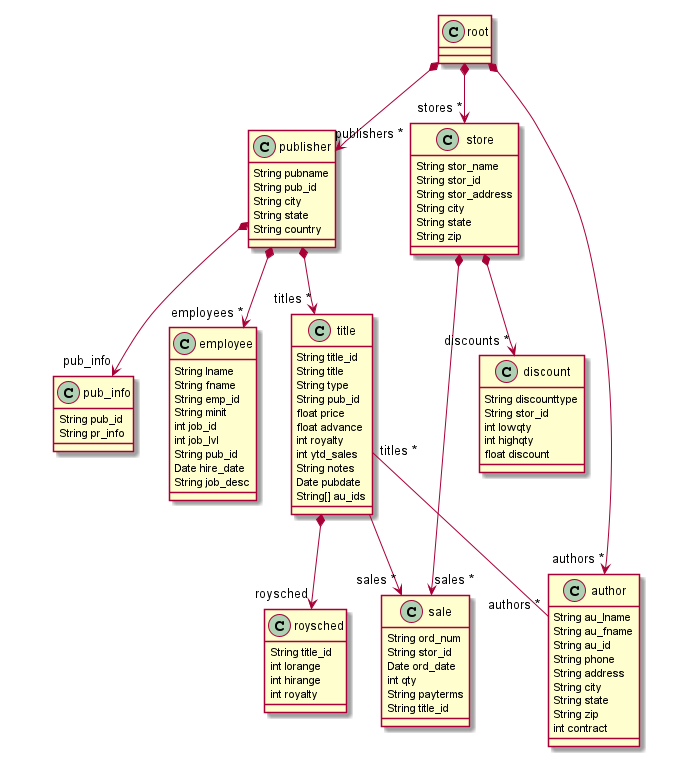

# tdt4250.project

### Requirements
The dependencies used for this project is:

* Ecore and Ecore Modeling Framework

* Sirius for visualization

* Jackson library for creating java objects from JSON strings
    * We use jackson-annotations, jackson-core and jackson-databind, all versions 2.6.2. We recommend using the same versions to avoid conflicts etc. Can be installed from http://download.eclipse.org/tools/orbit/downloads/drops/R20170919201930/repository

### Setup 

* Clone the repo: ``` git clone https://github.com/PederEspen/tdt4250.project.git ```
* Add the three project folders (.model_resource, .project.design and .project.examples) to your Eclipse workspace
* In order to create the .xmi file, navigate to **tdt4250.model_resource/src/transformations** and run the **JsonToModel.java** file as a Java Application
* Refresh the **/model** folder in order for the .xmi file to appear in the system

#### View and edit data

* Navigate to **tdt4250.design/description/** and open the **design.odesign** file. This file can be used to view how the different diagrams are set up
* In order to view the actual diagrams, navigate to **tdt4250.examples/** and open the **representations.aird** file. The .xmi file should already be added as a dependency, but if it isnt just add it manually from the model folder.
* Expand the different diagrams under PubsViewPoint and double click on the first element under each diagram to view them (alternatively you can create new ones).

### Fetch from API and transform from JSON to Java objects

The fetching is handled in the tdt4250.model_resource, inside /src/transformation/JSONtoModel.java file.
Here the data is saved to JSON files that we later use to create java classes. This is done by importing the Jackson library, which allows for converting JSON files to java objects.

The JavaMToEcoreM.java file creates a XMI file via a M2M (Model-To-Model) transformation. This XMI file can then be used by the other projects to create, edit and view different diagrams which display the dataset structure and contents.

### Model

We chose a publically available dataset from the relational database. (Link: https://relational.fit.cvut.cz/dataset/Pubs)
The dataset contains a variety of information about book publishers, for example:
* Several different publishers
* Titles that they have published
* Authors which have written the books
* Stores which have bought certain amounts of said titles
* Employees working for the publishers
The below image shows the structure of the dataset (taken from https://relational.fit.cvut.cz/assets/img/datasets-generated/pubs.svg):


One thing we had to consider was that there is no single root of the dataset. Publishers, Authors, Stores and Jobs all exist independently. Because XML is naturally hierarchical and prefers having a single root, we chose to add an empty root object which contained links to Publishers, Authors and Stores. We also chose to remove the TitleAuthor link from the dataset, and instead linked Titles and Authors directly using EOpposite. Lastly, we chose to not include the "jobs" table as the only relevant information it contained was the job descriptions of the employees, which was instead implemented directly in the Employee class. The below image shows the final ecore model:



## Viewer

For this project we decided to make different views for visualizing the different data. We explored different kinds of tools for displaying the view in this project, and therefore ended up making diagrams, tables, cross-tables and trees. 

### Diagram

We created two diagrams for this project. One visualizing all publishers and one visualizing a title for one book. 


The publisher diagram shows the different publishers and the titles within the publishers. In the picture above we only show two diagrams and that is because we added a filter that filters out the publishers that do not have any titles within.

We added navigation to the project, making it possible to click on a title in the publisher diagram, which then navigates to a title diagram as depicted in the picture below. When double-clicking on a title you create a new title diagram. 

 

For the title diagram we show the title of the book, what author(s), the price and how many that has bought the book. 

### Table

For visualizing the different stores in this project we used a table. As you can see in the picture below, we first visualize all stores in the database and then we the different orders a store currenctly have. 


For this table we included a conditional style which changes the color of the table if the number of orders within a store is greater then two. As you can see in the picture above, the first two stores has a grey color since they only have two orders, whereas the remaining four stores has a blue color.

### Tree

When creating a tree we decided to show the different publishers and their employees. The picture below shows how this is represented using a tree view. 


In the picture you see different publishers, their employees and the employees' jobs.

### Cross-table 

The last feature we made was a cross-table view. As seen in the picture below, each line in this table represents different titltes and the columns represent different authors. The cross-table view then tells us which author that is connected to what title and is represented with an "X". 


